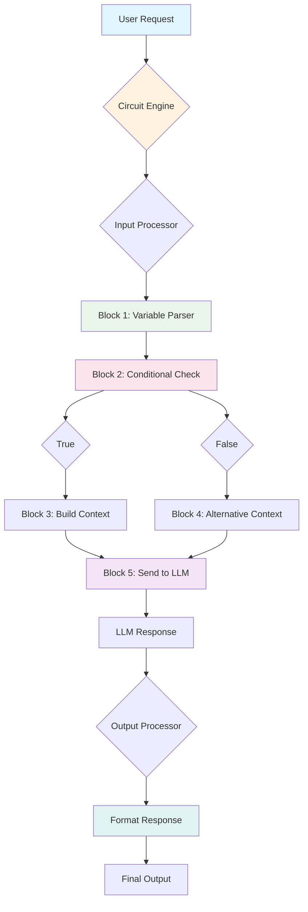

# Prompt Manager & Circuits System Implementation Plan

## Overview

The Prompt Manager & Circuits system represents a paradigm shift in how CoolChat handles AI interactions by introducing a visual, flowchart-based editor for managing all prompts, variables, and logic blocks. This system replaces hardcoded prompt construction with a flexible, user-customizable workflow builder called "Circuits".

### Key Objectives
- Provide a drag-and-drop interface for creating complex prompt workflows
- Support dynamic logic blocks including conditional statements, random selections, and variables
- Enable full user customization of AI interactions without code changes
- Maintain backward compatibility with existing prompt structures during migration
- Enhance testing and validation capabilities for prompt injection systems

### Phase 2b Scope
This implementation plan covers Phase 2b of the CoolChat roadmap, focusing on the complete rollout of the Prompt Manager & Circuits system following initial architecture planning in previous phases.

## System Architecture

The system follows a layered architecture with clear separation of concerns:

### Core Layers
1. **Presentation Layer**: Frontend Visual Editor (React-based)
2. **Application Layer**: Circuit Execution Engine (FastAPI/Python)
3. **Data Layer**: SQLite Database for circuit persistence
4. **Integration Layer**: API adapters for LLM providers and existing systems

### High-Level Architecture Diagram
```
┌─────────────────┐
│   Frontend UI   │ ← Visual Editor
└─────────┬───────┘
          │
┌─────────────────┐
│  Circuit Engine │ ← Execution Logic
└─────────┬───────┘
          │
┌─────────────────┐
│ Data Persistence │ ← SQLite Circuit Storage
└─────────────┬───┘
              │
     ┌────────▼────────┐
     │  LLM Providers  │ ← API Integration
     └─────────────────┘
```

### Data Flow Overview
Circuits process user inputs through configurable logic blocks, generating final prompts sent to AI providers. The system maintains full traceability from input to final AI response.

## Component Breakdown

### Frontend Components

#### 1. Circuit Editor
- **Canvas Component**: Main workflow visualization area
- **Block Palette**: Sidebar containing available logic blocks
- **Properties Panel**: Configuration editor for selected blocks
- **Toolbar**: Save, Load, Undo/Redo, Export controls

#### 2. Block Types
- **Logic Blocks**:
  - If/Then/Else conditional blocks
  - Random Choice selectors
  - Counter and variable management
- **Content Blocks**:
  - System prompts
  - User persona formatters
  - Lore injection templates
- **Integration Blocks**:
  - AI provider connectors
  - Variable parsers

### Backend Components

#### 1. Circuit Execution Engine
- **Parser**: Interprets serialized circuit definitions
- **Executor**: Runs circuit logic in sequential or parallel flows
- **Validator**: Pre-flight checks for circuit integrity

#### 2. Circuit Storage Management
- **Repository**: Database abstraction layer for circuit CRUD operations
- **Serializer**: Converts UI models to persistent formats
- **Version Manager**: Handles circuit versioning and backups

#### 3. Integration Adapters
- **LLM Connector**: Standardized interface to AI providers
- **Prompt Builder**: Constructs final prompts from circuit outputs
- **Context Manager**: Manages memory, lore, and character data integration

## Data Flow

Refer to the flowchart saved as `circuitlogicchart.png` for a visual representation of the data flow.

### Mermaid Diagram Code for Data Flow



### Key Data Flow Stages
1. **Input Processing**: Parse user message and extract context
2. **Circuit Execution**: Process through configured logic blocks
3. **Context Building**: Integrate character, lore, and memory data
4. **Prompt Generation**: Construct final prompt for AI provider
5. **Response Handling**: Process and display AI response

## UI Descriptions

### Main Circuit Editor Interface

#### Layout Structure
- **Top Bar**: File operations, zoom controls, view options
- **Left Sidebar**: Block library with drag-and-drop functionality
- **Center Canvas**: Visual workflow editor with zoom and pan
- **Right Panel**: Block properties and configuration editor
- **Bottom Panel**: Execution output and debugging console

#### Visual Design Principles
- Clean, node-based editor similar to tools like Unreal Blueprints or Godot Visual Scripts
- Color-coded block types for quick identification
- Connection lines with data flow direction indicators
- Contextual tooltips and help overlays
- Responsive design supporting desktop to tablet viewports

### Block Visual Specifications

| Block Type | Icon | Color Scheme | Key Properties |
|------------|------|-------------|----------------|
| Logic Blocks | ⚡ | Blue tones | Condition expressions |
| Content Blocks | 📝 | Green tones | Template strings, variables |
| Flow Control | ↗️ | Purple tones | Branch conditions |
| Integration | 🔗 | Orange tones | API endpoints, provider settings |

### Modal Interfaces
- **Block Configuration Modal**: Property editor with validation
- **Circuit Save/Load Dialog**: File browser with preview thumbnails
- **Import/Export Modal**: Options for JSON/Mermaid export formats

## Logging Strategy

### Log Categories
1. **Execution Logs**: Circuit flow tracing, node-by-node processing
2. **Error Logs**: Exception handling with stack traces and context
3. **Performance Logs**: Timing metrics for block execution
4. **User Action Logs**: UI interactions for debugging user workflows

### Structured Logging Format
```json
{
  "timestamp": "2025-01-09T12:34:56Z",
  "level": "INFO",
  "circuit_id": "uuid-1234",
  "node_id": "block-456",
  "action": "EXECUTE_BLOCK",
  "context": {
    "input": {"message": "Hello", "variables": {"user": "John"}},
    "output": "Processed message",
    "duration_ms": 45
  }
}
```

### Log Levels and Retention
- **INFO**: Normal execution flow
- **WARN**: Non-critical issues requiring attention
- **ERROR**: Failures affecting circuit execution
- **DEBUG**: Detailed internal processing (development only)

Retention policy: 30 days rolling for INFO/WARN, 90 days for errors.

## Testing Plan

### Unit Testing Strategy
- **Block Tests**: Test individual logic blocks with mock inputs
- **Engine Tests**: Validate execution engine with various circuit configurations
- **Storage Tests**: CRUD operations and data integrity checks

### Integration Testing
- **Circuit Execution**: End-to-end workflow testing
- **API Integration**: Mock LLM provider responses
- **Database Operations**: Circuit persistence and retrieval

### E2E Testing Scenarios
1. User builds a simple greeting circuit
2. Complex workflow with conditionals and variables
3. Error handling and recovery flows
4. UI interactions and saving/loading circuits

### Testing Tools
- **Backend**: pytest with coverage reporting
- **Frontend**: Vitest for component testing
- **E2E**: Playwright for browser automation
- **Coverage Goal**: Minimum 80% code coverage across all layers

## Deployment Strategy

### Rollout Phases
1. **Alpha**: Internal testing with developer circuits
2. **Beta**: Limited user access with feature flags
3. **Production**: Full rollout with monitoring and rollback plans

### Deployment Considerations
- **Feature Flags**: Enable/disable circuits per user or globally
- **Gradual Migration**: Co-existence with existing prompt system
- **Health Checks**: Circuit execution monitoring and alerts
- **Rollback Plan**: Revert to legacy prompt construction if issues arise

### CI/CD Integration
- Automated tests on PR submissions
- Docker containerization for consistent deployment
- Blue-green deployment strategy for zero-downtime updates

## Migration Plan

### Phase 1: Preparation
- Create circuit templates for current prompt structures
- Implement dual-path processing (legacy + circuits)
- Database schema migration for circuit storage

### Phase 2: Transition
- Migrate high-priority circuits (character prompts, lore injection)
- Update system documentation and user guides
- Train users on visual editor usage

### Phase 3: Completion
- Deprecate legacy hardcoded prompts
- Remove dual-path processing overhead
- Optimize circuit execution performance

### Rollback Strategy
- Maintain legacy prompt constructor as backup
- Automated migration scripts with revert capability
- Data backup prior to each migration step

## Scalability Considerations

### Performance Optimization
- **Circuit Caching**: Cache compiled circuits to reduce parse overhead
- **Asynchronous Processing**: Non-blocking execution for long-running circuits
- **Resource Limits**: CPU/memory limits per circuit execution

### Database Scalability
- **Connection Pooling**: Efficient database connection management
- **Indexing Strategy**: Optimized queries for circuit retrieval and search
- **Archiving**: Compress old circuit versions periodically

### Frontend Performance
- **Virtual Scrolling**: Handle large circuits efficiently
- **Debounced Updates**: Input throttling for smooth user experience
- **Progressive Loading**: Load circuit blocks on demand

### Horizontal Scaling
- **Load Balancing**: Distribute circuit executions across multiple instances
- **Session Affinity**: Maintain user circuit state across requests
- **Shared Storage**: Distributed filesystem for circuit assets and media

### Monitoring and Alerting
- **Performance Metrics**: Response times, error rates, resource usage
- **Circuit Health Checks**: Automated validation of stored circuits
- **Auto-scaling**: Dynamic instance allocation based on load

This implementation plan provides a comprehensive roadmap for the Prompt Manager & Circuits system, ensuring a robust, scalable, and user-friendly solution for managing AI prompt workflows.