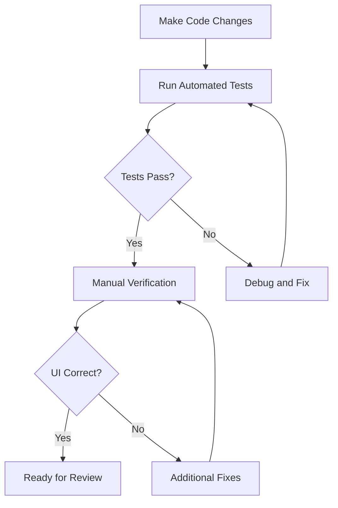

# Comprehensive Circuit Editor UI Testing Methodology

## Overview

This methodology addresses the persistent UI update issues in the Circuit Editor where changes to blocks are not reflecting correctly in the interface, leading to false positives in reported fixes. It provides rigorous testing specifically for Circuit Editor UI components.

## Current Issues Identified

Based on code analysis of `CircuitEditor2.tsx` and `circuitStore.ts`:

- **Properties Panel**: Sections not displaying correctly (lines 1928, 2001-2002, 2048)
- **Current Values Section**: Only shows static block settings, not runtime input/output data
- **Live Data Section**: Not loading or displaying data correctly
- **Configuration Section**: Always shows "Not set" despite having data
- **Block Updates**: Changes not propagating through ReactFlow state management

## Testing Methodology

### 1. Pre-Change Baseline Establishment

#### 1.1 Capture Initial State
```javascript
const baseline = await captureCircuitEditorState();
console.log('Baseline captured:', baseline);
```

**Validation Points:**
- Current selectedNode data structure
- Properties panel visibility and content
- Block settings values
- Connection status indicators
- Execution outputs state

#### 1.2 DOM Snapshot
Take screenshots of:
- Properties panel sections
- Current values display
- Block palette items
- Canvas with connections
- Execution results panel

### 2. Change Implementation Phase

#### 2.1 Code Modification Tracking
Track all file changes:
```javascript
const changes = await trackFileChanges([
  'frontend/src/components/circuits/CircuitEditor2.tsx',
  'frontend/src/stores/circuitStore.ts',
  'frontend/src/components/circuits/CircuitModal.tsx'
]);
```

#### 2.2 State Management Validation
Verify Zustand store updates:
- `circuitStore.current` updates
- `executionResult` population
- `executionOutputs` updates
- Node data persistence

### 3. Post-Change Validation Protocol

#### 3.1 Immediate State Verification
```javascript
const postChangeState = await captureCircuitEditorState();
const stateValidation = validateStateChanges(baseline, postChangeState);
```

**Critical Checks:**
- Properties panel sections render correctly
- Current values show runtime data (not just static settings)
- Connection status updates properly
- Block settings propagate to UI

#### 3.2 UI Rendering Validation
Automated checks for:
- JSX elements present in DOM
- CSS classes applied correctly
- React component lifecycle completion
- Event handlers attached properly

#### 3.3 Data Flow Verification
Test complete data flow:
```javascript
const dataFlowTest = await testDataFlow({
  source: 'blockSettings',
  target: 'propertiesPanel',
  dataType: 'runtimeValues'
});
```

### 4. Integration Testing Framework

#### 4.1 Circuit Execution Testing
```javascript
const executionTest = await testCircuitExecution({
  circuitId: 'test-circuit-001',
  expectedOutputs: ['output1', 'output2'],
  validateUIUpdates: true
});
```

**Test Scenarios:**
- Block property changes during execution
- Real-time value updates in Current Values section
- Connection status changes
- Error state handling

#### 4.2 ReactFlow Integration Tests
Verify ReactFlow-specific functionality:
- Node selection and property updates
- Edge creation/deletion and UI reflection
- Canvas interactions and state persistence
- MiniMap and Controls functionality

### 5. Automated Testing Scripts

#### 5.1 Property Panel Validation Script
```javascript
// circuit-property-test.js
const testPropertyPanel = async (circuitId, nodeId) => {
  // 1. Load circuit and select node
  // 2. Verify all property sections render
  // 3. Test data binding and updates
  // 4. Validate real-time value display
  // 5. Check connection status indicators
};
```

#### 5.2 State Synchronization Test
```javascript
// circuit-state-sync-test.js
const testStateSynchronization = async () => {
  // 1. Modify node data via store
  // 2. Verify UI updates within 100ms
  // 3. Test bidirectional data flow
  // 4. Validate error handling
};
```

#### 5.3 Visual Regression Test
```javascript
// circuit-visual-regression.js
const testVisualRegression = async () => {
  // 1. Capture baseline screenshots
  // 2. Make UI changes
  // 3. Compare post-change screenshots
  // 4. Flag visual differences
  // 5. Generate diff reports
};
```

### 6. Manual Verification Steps

#### 6.1 Properties Panel Checklist
- [ ] Block Description section displays correctly
- [ ] Block Settings section shows current values
- [ ] Configuration section populated (not "Not set")
- [ ] Current Values section shows runtime data
- [ ] Live Data section loads and displays
- [ ] Metadata section shows correct information

#### 6.2 Interaction Testing
- [ ] Select different block types
- [ ] Modify block settings via form inputs
- [ ] Create and delete connections
- [ ] Execute circuit and observe real-time updates
- [ ] Switch between circuits
- [ ] Test keyboard shortcuts (Delete, etc.)

### 7. Cross-Browser and Device Testing

#### 7.1 Browser Compatibility Matrix
- Chrome 90+
- Firefox 88+
- Safari 14+
- Edge 90+

#### 7.2 Device Testing
- Desktop (1920x1080+)
- Tablet (768x1024)
- Mobile (375x667)

#### 7.3 Responsive Design Verification
- Canvas scaling
- Properties panel positioning
- Block palette usability
- Touch interactions on mobile

### 8. Debugging and Troubleshooting Tools

#### 8.1 Enhanced Debug Logging
```javascript
// Add to CircuitEditor2.tsx for comprehensive debugging
console.log('[CIRCUIT-DEBUG] selectedNode:', selectedNode);
console.log('[CIRCUIT-DEBUG] edges:', edges);
console.log('[CIRCUIT-DEBUG] executionOutputs:', executionOutputs);
console.log('[CIRCUIT-DEBUG] propertiesPanelKey:', propertiesKey);
```

#### 8.2 State Inspector Tool
```javascript
// circuit-state-inspector.js
const inspectCircuitState = () => {
  const store = useCircuitStore.getState();
  const componentState = {
    nodes: nodes,
    edges: edges,
    selectedNode: selectedNode,
    executionResult: executionResult
  };

  return {
    storeIntegrity: validateStoreIntegrity(store),
    componentIntegrity: validateComponentIntegrity(componentState),
    dataFlowIntegrity: validateDataFlow(componentState, store)
  };
};
```

### 9. Tools and Scripts Implementation

#### 9.1 Integration with Existing Test Framework
Extend current `test-methodology.js` with Circuit Editor specific tests:

```javascript
// Add to test-methodology.js
const circuitEditorTests = {
  testPropertyPanelUpdates: async () => { /* implementation */ },
  testCurrentValuesDisplay: async () => { /* implementation */ },
  testStateSynchronization: async () => { /* implementation */ },
  testExecutionUIUpdates: async () => { /* implementation */ }
};
```

#### 9.2 NPM Scripts Addition
```json
// Add to package.json scripts
{
  "test:circuit-ui": "node test-methodology.js circuit-ui-tests",
  "test:circuit-visual": "node test-visual-regression.js circuit-editor",
  "test:circuit-integration": "node test-integration.js circuit-execution"
}
```

### 10. Success Criteria and Validation Standards

#### 10.1 Minimum Success Criteria
- [ ] Properties panel updates within 100ms of state changes
- [ ] Current Values section shows actual runtime data
- [ ] No "Not set" placeholders in configuration sections
- [ ] Live Data section loads within 2 seconds
- [ ] Visual regression tests pass with <1% difference threshold
- [ ] All automated tests pass before deployment

#### 10.2 Quality Gates
- **Gate 1**: Code changes applied correctly
- **Gate 2**: State synchronization verified
- **Gate 3**: UI rendering validated
- **Gate 4**: Integration tests passed
- **Gate 5**: Manual verification completed
- **Gate 6**: Cross-browser testing completed

### 11. Implementation Steps

1. **Phase 1**: Implement automated property panel validation
2. **Phase 2**: Create state synchronization testing
3. **Phase 3**: Develop visual regression testing
4. **Phase 4**: Build integration testing framework
5. **Phase 5**: Establish monitoring and alerting
6. **Phase 6**: Training and documentation

### 12. Workflow Integration

#### 12.1 Development Workflow


#### 12.2 CI/CD Integration
- Pre-commit hooks for automated testing
- Build pipeline integration
- Automated visual regression testing
- Performance monitoring for UI updates

This methodology ensures that every Circuit Editor UI change is thoroughly validated through multiple layers of verification, eliminating false positives and ensuring reliable UI updates.